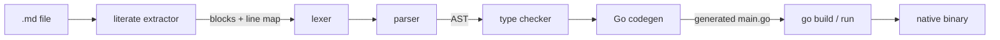

# Inkdown

**A programming language whose programs are Markdown documents, compiled to
native binaries with Go — with a standard library for the web and LLMs.**

An Inkdown program *is* its own documentation: prose explains, and only the
fenced code blocks tagged `inkdown` compile (literate programming). GitHub
renders every program as a readable manual. The compiler is pure Go with zero
dependencies — it transpiles Inkdown to Go and lets `go build` do the heavy
lifting, so you get real native binaries, garbage collection, and Go's
runtime for free. The stdlib (HTTP server and client, JSON, LLM calls) is
generated from the Go standard library only, so binaries stay self-contained.

This is a complete program (see [examples/hello.md](examples/hello.md)):

~~~markdown
# Hello, world

The smallest possible Inkdown program.

```inkdown
print("Hello, world!")
```
~~~

```
$ inkdown run examples/hello.md
Hello, world!
```

And this Markdown document talks to Claude:

~~~markdown
# Ask Claude

```inkdown
print(llm.ask("Explain literate programming in one sentence."))
```
~~~

```
$ export ANTHROPIC_API_KEY=sk-ant-...
$ inkdown run ask.md
Literate programming is writing a program as an essay for humans —
prose first, code woven in — from which the machine extracts the
executable parts.
```

## Quickstart

You need Go 1.22+. From this directory:

```bash
# run a program straight from its Markdown file
go run ./cmd/inkdown run examples/fibonacci.md

# or install the CLI
go install github.com/justfedec/inkdown/cmd/inkdown@latest
inkdown run examples/todo-api.md
```

## CLI

| Command                                | What it does                              |
| -------------------------------------- | ----------------------------------------- |
| `inkdown run program.md`               | compile and execute                        |
| `inkdown build program.md [-o name]`   | produce a native binary (default: `program`) |
| `inkdown check program.md`             | parse and type-check only                  |
| `... --emit-go out.go`                 | (run/build) also write the generated Go    |

## The language in 30 seconds

Statically typed with inference, four basic types (`int`, `float`, `string`,
`bool`) plus lists (`[T]`) and opaque handles (`server`, `request`,
`response`), immutable-by-default bindings, and no implicit conversions. The
full definition lives in [SPEC.md](SPEC.md).

```
func fib(n: int) -> int {
  if n < 2 { return n }
  return fib(n - 1) + fib(n - 2)
}

let label = "fib"        # immutable, type inferred
var results: [int] = []  # mutable, annotated

for i in range(0, 10) {
  push(results, fib(i))
}
print(label, results, len(results))
```

- **Literate rule** — all ```` ```inkdown ```` blocks in the document are
  concatenated top to bottom into one program; blocks tagged
  ```` ```inkdown example ```` are documentation only and never compile.
- **Keywords** — `func return let var if else while for in break continue and
  or not true false`.
- **Top-level code is `main`** — statements run top to bottom; top-level
  declarations are globals visible inside functions; functions are hoisted, so
  the document can be ordered for the reader, not for the compiler.

## The standard library

One grammar extension powers all of it: builtins can live in namespaces and
are called as `http.get(...)`. Everything else is predeclared names.

**Strings** — `split`, `join`, `contains`, `starts_with`, `index_of`,
`substring`, `trim`, `lower`, `upper`, `replace`. Positions count runes, so
they compose on UTF-8 text.

**Process** — `env`, `eprint`, `exit`, `read_line`, and the guards `is_int` /
`is_float` so untrusted input never panics.

**Web server** — no callbacks, no handler registration: a blocking accept
loop. One request at a time, which is exactly as much concurrency as the
language has.

```
let srv = http.serve(8080)
while true {
  let req = http.next(srv)
  http.respond(req, 200, "hello " + http.path(req))
}
```

**HTTP client** — `http.get` / `http.post` / `http.request`. Transport
failures never panic: check `http.ok(resp)` and `http.status(resp)`.

**JSON** — no maps needed: `json.get(doc, "todos.0.title")` walks a document
with a dot-path, `json.has` guards, `json.len` sizes arrays, and
`json.escape` makes building JSON by concatenation safe.

**LLM** — `llm.ask(prompt)` / `llm.ask(prompt, system)` call the Anthropic
Messages API with `ANTHROPIC_API_KEY` from the environment (model defaults to
`claude-opus-4-8`; override with `INKDOWN_LLM_MODEL`). The implementation is
`net/http` from the Go stdlib — zero dependencies, hermetic builds.

The error-handling philosophy is **guards + accessors**: test with `is_int` /
`json.has` / `http.ok` where failure is expected; panics (which map to your
`.md` line) are reserved for programmer errors. See
[SPEC.md §7](SPEC.md#7-builtins).

## Diagnostics that point at your document

The compiler tracks every extracted line back to the Markdown file, so both
compile-time errors and runtime panics reference the `.md` you actually wrote:

```
$ inkdown check bad.md
inkdown: bad.md:13:13: operator '+' has mismatched operand types (string and int)

$ inkdown run oops.md
panic: runtime error: index out of range [5] with length 2
        ...
        oops.md:8
```

The generated Go carries `//line` directives, which is how panic stack traces
land on the right Markdown line.

## How it works



| Stage      | Package               | Notes |
| ---------- | --------------------- | ----- |
| extract    | `internal/literate`   | finds ```` ```inkdown ```` fences, keeps a line map to the document |
| lex        | `internal/lexer`      | newline-terminated statements, implicit line joining inside `(` `)` `[` `]` |
| parse      | `internal/parser`     | recursive descent into `internal/ast` |
| check      | `internal/check`      | name resolution, inference, mutability, control-flow rules |
| stdlib     | `internal/stdlib`     | one registry table per builtin: signature for the checker, prelude chunk for codegen |
| emit       | `internal/codegen`    | readable Go, `//line` directives, and only the prelude chunks the program uses |
| drive      | `internal/driver`     | temp module, `go build`, exit-code plumbing |

The emitted Go is meant to be read — try `--emit-go`. A program that never
touches the network compiles to the same lean output as v1; use `http.` once
and only that chunk (plus its imports) appears.

## Examples

- [examples/hello.md](examples/hello.md) — the smallest program
- [examples/fibonacci.md](examples/fibonacci.md) — functions, recursion, hoisting
- [examples/fizzbuzz.md](examples/fizzbuzz.md) — `%`, `if / else if / else`
- [examples/lists.md](examples/lists.md) — lists, `push`, `while`, conversions, globals
- [examples/strings.md](examples/strings.md) — the string builtins and guards
- [examples/json.md](examples/json.md) — dot-path JSON reading and safe building
- [examples/hello-web.md](examples/hello-web.md) — the smallest web server
- [examples/todo-api.md](examples/todo-api.md) — **a full todo REST API in Markdown** (this repo's original Go API, reborn)
- [examples/claude-chat.md](examples/claude-chat.md) — a terminal chat with Claude

Examples with deterministic output are golden tests (their stdout is pinned
in a sibling `.out` file); the web and LLM examples are type-checked in CI
and exercised end-to-end by the driver tests against real binaries and fake
servers.

## Tests

```bash
go test ./...
```

Every stage has unit tests, the golden suite runs the deterministic examples
end to end, and the e2e suite builds real binaries: a web server exercised
over TCP, the HTTP client against `httptest`, and `llm.ask` against a fake
Messages API (`ANTHROPIC_BASE_URL`) — no test needs the network or an API
key.

## Status and roadmap

This is v2: v1's deliberately small core plus namespaced builtins, handle
types, and the web/LLM stdlib. Still out by design (see
[SPEC.md §11](SPEC.md#11-limitations-and-future-directions)): maps and
structs, first-class functions, imports/multi-file programs, concurrency,
and `let x, err = ...` error binding.
