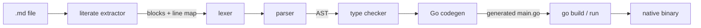

# Inkdown

**A programming language whose programs are Markdown documents, compiled to
native binaries with Go.**

An Inkdown program *is* its own documentation: prose explains, and only the
fenced code blocks tagged `inkdown` compile (literate programming). GitHub
renders every program as a readable manual. The compiler is pure Go with zero
dependencies — it transpiles Inkdown to Go and lets `go build` do the heavy
lifting, so you get real native binaries, garbage collection, and Go's
runtime for free.

This is a complete program (see [examples/hello.md](examples/hello.md)):

~~~markdown
# Hello, world

The smallest possible Inkdown program.

```inkdown
print("Hello, world!")
```
~~~

```
$ inkdown run examples/hello.md
Hello, world!
```

## Quickstart

You need Go 1.22+. From this directory:

```bash
# run a program straight from its Markdown file
go run ./cmd/inkdown run examples/fibonacci.md

# or install the CLI
go install ./cmd/inkdown
inkdown run examples/fizzbuzz.md
```

## CLI

| Command                                | What it does                              |
| -------------------------------------- | ----------------------------------------- |
| `inkdown run program.md`               | compile and execute                        |
| `inkdown build program.md [-o name]`   | produce a native binary (default: `program`) |
| `inkdown check program.md`             | parse and type-check only                  |
| `... --emit-go out.go`                 | (run/build) also write the generated Go    |

## The language in 30 seconds

Statically typed with inference, four basic types (`int`, `float`, `string`,
`bool`) plus lists (`[T]`), immutable-by-default bindings, and no implicit
conversions. The full definition lives in [SPEC.md](SPEC.md).

```
func fib(n: int) -> int {
  if n < 2 { return n }
  return fib(n - 1) + fib(n - 2)
}

let label = "fib"        # immutable, type inferred
var results: [int] = []  # mutable, annotated

for i in range(0, 10) {
  push(results, fib(i))
}
print(label, results, len(results))
```

- **Literate rule** — all ```` ```inkdown ```` blocks in the document are
  concatenated top to bottom into one program; blocks tagged
  ```` ```inkdown example ```` are documentation only and never compile.
- **Keywords** — `func return let var if else while for in break continue and
  or not true false`.
- **Builtins** — `print`, `len`, `range(a, b)`, `push(list, x)`, and the
  conversions `str`, `int`, `float`.
- **Top-level code is `main`** — statements run top to bottom; top-level
  declarations are globals visible inside functions; functions are hoisted, so
  the document can be ordered for the reader, not for the compiler.

## Diagnostics that point at your document

The compiler tracks every extracted line back to the Markdown file, so both
compile-time errors and runtime panics reference the `.md` you actually wrote:

```
$ inkdown check bad.md
inkdown: bad.md:13:13: operator '+' has mismatched operand types (string and int)

$ inkdown run oops.md
panic: runtime error: index out of range [5] with length 2
        ...
        oops.md:8
```

The generated Go carries `//line` directives, which is how panic stack traces
land on the right Markdown line.

## How it works



| Stage      | Package               | Notes |
| ---------- | --------------------- | ----- |
| extract    | `internal/literate`   | finds ```` ```inkdown ```` fences, keeps a line map to the document |
| lex        | `internal/lexer`      | newline-terminated statements, implicit line joining inside `(` `)` `[` `]` |
| parse      | `internal/parser`     | recursive descent into `internal/ast` |
| check      | `internal/check`      | name resolution, inference, mutability, control-flow rules |
| emit       | `internal/codegen`    | readable Go, small runtime prelude, `//line` directives |
| drive      | `internal/driver`     | temp module, `go build`, exit-code plumbing |

The emitted Go is meant to be read — try `--emit-go`:

```go
//line fibonacci.md:14
func fib(n int) int {
//line fibonacci.md:15
	if n < 2 {
//line fibonacci.md:15
		return n
	}
//line fibonacci.md:16
	return fib(n - 1) + fib(n - 2)
}
```

## Examples

- [examples/hello.md](examples/hello.md) — the smallest program
- [examples/fibonacci.md](examples/fibonacci.md) — functions, recursion, hoisting, `inkdown example` blocks
- [examples/fizzbuzz.md](examples/fizzbuzz.md) — `%`, `if / else if / else`
- [examples/lists.md](examples/lists.md) — lists, `push`, `while`, conversions, globals

Each example is also a golden test: its output is pinned in the sibling
`.out` file.

## Tests

```bash
go test ./...
```

Every stage has unit tests, and the driver test suite compiles and runs all
the examples end to end (it needs the `go` tool in `PATH`, which you have if
you are running `go test`).

## Status and roadmap

This is v1 of a deliberately small language. Not in v1 (by design, see
[SPEC.md](SPEC.md#11-limitations-and-future-directions)): maps and structs,
first-class functions, string indexing, imports/multi-file programs, and
multiple-error reporting.
